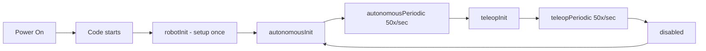

# Robot Architecture

How a robot program is organized and how it runs.

## How the Robot Runs

When you turn on the robot, here is what happens:



### The Robot Lifecycle

| Method | When It Runs | What To Put Here |
|--------|-------------|-----------------|
| `robotInit()` | Once when robot turns on | Create subsystems, load settings |
| `autonomousInit()` | Once when auto starts | Set targets for auto routine |
| `autonomousPeriodic()` | 50x/sec during auto | Check sensors, run autonomous logic |
| `teleopInit()` | Once when teleop starts | Prepare for driver control |
| `teleopPeriodic()` | 50x/sec during teleop | Read joysticks, drive the robot |

**Init vs Periodic:** Init runs once (like pressing "start" on a microwave). Periodic runs 50 times per second (like the microwave constantly checking if your food is done).

## Project Structure

How the XBot codebase is organized:

```
TeamXbot2026/
├── src/
│   └── main/java/competition/
│       ├── electrical_contract/    # Wiring definitions (which motor on which port)
│       ├── subsystems/             # Robot mechanisms (drive, shooter, intake)
│       │   ├── drive/
│       │   ├── shooter/
│       │   └── intake/
│       ├── operator_interface/     # Gamepad button bindings
│       └── Robot.java              # Main robot class (lifecycle)
```

<details>
<summary><strong>What is a Subsystem?</strong></summary>

A **subsystem** represents one physical part of the robot. Think of it like an organ in a body -- each organ has a specific job:

- **DriveSubsystem** = legs (moves the robot)
- **ShooterSubsystem** = arm (shoots game pieces)
- **IntakeSubsystem** = hand (picks up game pieces)

Each subsystem controls its own motors and sensors, and provides methods for other code to use.

</details>

## The Entry Point

```java
// Main.java -- the first code that runs when the robot turns on
public final class Main {
    public static void main(String... args) {
        RobotBase.startRobot(Robot::new);
    }
}
```

You should never need to modify this file. It is the same for every FRC robot.

## The Robot Class

```java
public class Robot extends BaseRobot {
    @Override
    protected void initializeSystems() {
        super.initializeSystems();
        // Connect buttons to commands, set default behaviors
        getInjectorComponent().subsystemDefaultCommandMap();
        getInjectorComponent().operatorCommandMap();
    }
}
```

This is where everything gets connected together. You will learn more about this as you progress through the curriculum.

## Core Programming vs Vision

| Team | What They Work On |
|------|------------------|
| **Core Programming** | Drive, shooter, intake, autonomous, robot infrastructure |
| **Vision** (future) | AprilTag detection, camera processing, path planning |

You will start on **Core Programming**. Vision is a separate team you can join later.

---

## Quiz

**Q1:** How many times per second does `teleopPeriodic()` run?

- [ ] A) Once
- [ ] B) 5 times per second
- [ ] C) 50 times per second
- [ ] D) 500 times per second

<details>
<summary>Answer</summary>

**C) 50 times per second**

The robot control loop runs at 50Hz, meaning `periodic()` methods are called every 20 milliseconds. This is fast enough to feel responsive to the driver.

</details>

**Q2:** What does `robotInit()` do?

- [ ] A) Runs 50 times per second
- [ ] B) Runs once when the robot turns on
- [ ] C) Runs when a button is pressed
- [ ] D) Runs when the match ends

<details>
<summary>Answer</summary>

**B) Runs once when the robot turns on**

`robotInit()` runs exactly once at startup to set up subsystems, load settings, and prepare the robot.

</details>

**Q3:** What does a subsystem represent?

- [ ] A) A file in the project
- [ ] B) One physical mechanism on the robot
- [ ] C) A gamepad button
- [ ] D) A type of motor

<details>
<summary>Answer</summary>

**B) One physical mechanism on the robot**

Each subsystem controls one part of the robot (drive, shooter, intake, etc.) with its own motors and sensors.

</details>
