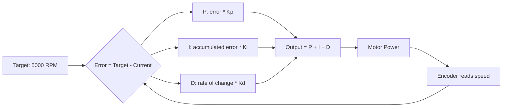

# PID Logic

How robots maintain precise position and speed automatically.

## What Is PID?

PID is a control loop that automatically adjusts power to reach and maintain a target. Think of it like cruise control for your robot.

| Term | What It Does | Real-World Analogy |
|------|-------------|-------------------|
| **P (Proportional)** | Reacts to how far off you are | "The shower is cold, turn the hot water way up" |
| **I (Integral)** | Reacts to how long you have been off | "Still cold after 30 seconds? Turn it up more" |
| **D (Derivative)** | Reacts to how fast you are approaching | "Getting warmer! Slow down so you do not overshoot" |

### How It Works



## PID in XBot

You do not need to write PID math yourself. XBot provides `PIDManager`:

```java
// Create PID with a factory (Dagger provides the factory)
PIDManager pid = pidFactory.create(
    "ShooterPID",    // Name for dashboard tuning
    4.0, 0.0, 0.0,  // P, I, D values
    1.0, -1.0        // max output, min output
);

// Use it every loop
double output = pid.calculate(targetSpeed, currentSpeed);
motor.setPower(output);
```

### Tuning PID Values

| Problem | What To Adjust |
|---------|---------------|
| Too slow reaching target | Increase **P** |
| Oscillates (wobbles around target) | Decrease **P**, increase **D** |
| Never reaches target (steady error) | Add some **I** |
| Overshoots then corrects | Increase **D** |

### Properties for Tuning

XBot stores PID values as **properties** so you can tune them at runtime without rebuilding:

```java
// In ShooterSubsystem constructor
this.pid = pidFactory.create("ShooterPID", propertyFactory, 4.0, 0.0, 0.0, 1.0, -1.0);

// Change "ShooterPID/P" from 4.0 to 3.0 on the dashboard
// The robot adjusts immediately without redeploying code!
```

---

## Quiz

**Q1:** What does the P (Proportional) term do?

- [ ] A) Predicts future error
- [ ] B) Reacts to current error (how far off you are)
- [ ] C) Accumulates error over time
- [ ] D) Sets the motor to full power

<details>
<summary>Answer</summary>

**B) Reacts to current error**

P adjusts output based on how far you are from the target. Big error = big adjustment. Small error = small adjustment. It is the main term that does the work.

</details>

**Q2:** If the motor oscillates (wobbles around the target), what should you try?

- [ ] A) Increase P
- [ ] B) Increase I
- [ ] C) Decrease P and/or increase D
- [ ] D) Do nothing, oscillations are normal

<details>
<summary>Answer</summary>

**C) Decrease P and/or increase D**

Oscillation means P is too aggressive. Lower P so the corrections are smaller, or increase D to dampen the overshoot.

</details>

**Q3:** Why does XBot store PID values as properties?

- [ ] A) To make the code slower
- [ ] B) So you can tune them without rebuilding the code
- [ ] C) Because Dagger requires it
- [ ] D) To save disk space

<details>
<summary>Answer</summary>

**B) So you can tune them without rebuilding the code**

Properties let you change PID values on the dashboard while the robot is running. This is essential at competitions where every second counts -- you can tune in real time instead of rebuilding and redeploying.

</details>
