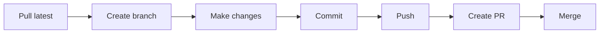

# Git & GitHub Desktop

How to save your code, share it with your team, and never lose work again.

## What is Version Control?

Version control is like having "undo" for your entire project. Every time you save a snapshot (called a **commit**), Git remembers exactly what your code looked like. You can go back to any previous version at any time.

**Analogy:** Imagine writing an essay and saving "version 1," "version 2," "version 3" as separate files. Git does this automatically, but much smarter:
- It only saves what changed (not the whole file every time)
- It lets multiple people work on the same project
- It shows exactly who changed what and when

## Git vs GitHub Desktop

| Tool | What It Does |
|------|-------------|
| **Git** | The engine that tracks changes (runs in the background) |
| **GitHub Desktop** | A visual app that lets you control Git with buttons |
| **GitHub.com** | A website that stores your code online for the team |

You do **not** need to type Git commands if you use GitHub Desktop. All the concepts are the same -- you just click buttons instead of typing.

## Getting Started

1. Open **GitHub Desktop**
2. Sign in with your GitHub account (create one at [github.com](https://github.com) if needed)
3. Click **File > Options > Accounts** to verify you are signed in

## Cloning (Downloading a Project)

When you join the team, you need to get a copy of the robot code on your computer. This is called **cloning**.

### Using GitHub Desktop:
1. Click **File > Clone Repository**
2. Go to the **URL** tab
3. Enter the repo URL (e.g., `https://github.com/Team488/TeamXbot2026.git`)
4. Choose where to save it on your computer
5. Click **Clone**

### What Happens When You Clone:
```
GitHub.com (main copy)  ----clone---->  Your computer (your copy)
```

You now have the entire project with all its history. You can edit, experiment, and break things without affecting the main project.

## The Basic Workflow

Every time you work on code, you follow this cycle:



### Step-by-Step:

#### 1. Pull Latest Changes
Before you start working, get the latest code from your team.

**AI tip:** If you use AI tools (like OpenCode) to help write code, always commit your changes before asking the AI for help. That way, you can undo anything you do not like.

**GitHub Desktop:** Click **Fetch origin** (top right), then **Pull origin** if there are new changes.

#### 2. Create a Branch
A **branch** is your own private copy of the code where you can experiment without breaking anything.

**GitHub Desktop:** Click the branch dropdown (top), click **New Branch**, name it something descriptive like `add-shooter-tuning`.

#### 3. Make Changes
Open the project in VSCode and edit the code. GitHub Desktop will automatically show you what files changed.

#### 4. Commit Your Changes
A **commit** is like saving a checkpoint. When you reach a good stopping point, commit.

**GitHub Desktop:**
1. Look at the **Changes** tab -- it shows what you changed
2. Write a **Summary** (required) -- describe what you changed
3. Write a **Description** (optional) -- explain why you changed it
4. Click **Commit to [branch-name]**

#### 5. Push to GitHub
Upload your commits so the team can see them.

**GitHub Desktop:** Click **Push origin**.

#### 6. Create a Pull Request
A **Pull Request (PR)** asks the team to review your changes and merge them into the main code.

**GitHub Desktop:** Click **Create Pull Request** (opens GitHub in your browser).

#### 7. Merge
After a mentor reviews and approves your code, it gets merged into the main branch.

## Branches Explained

Branches are the most important concept in Git. Here is why they matter:

**Analogy:** Imagine the `main` branch is the "official" robot code that everyone uses. Your feature branch is a "testing lab" where you can try new things. If you break something in the testing lab, the official robot still works.

```
main branch:    [Stable]----[Stable]----[Stable]----[Stable]
                      \                           /
feature branch:       [Experiment]----[Fix]----[Done]
```

### Branch Naming Convention
Use descriptive names so everyone knows what you are working on:

| Good Names | Bad Names |
|------------|-----------|
| `add-shooter-pid` | `my-branch` |
| `fix-drive-reverse` | `test` |
| `update-elevator-limits` | `asdf` |
| `add-intake-sensors` | `new-stuff` |

## Commit Messages

Good commit messages help your team (and future-you) understand what happened.

### The Formula:
```
[Action] [what] [why if needed]
```

### Examples:

| Good | Bad |
|------|-----|
| `Add PID tuning for elevator L4 height` | `fix` |
| `Fix drive motor inversion on front-right` | `stuff` |
| `Remove unused import in ShooterSubsystem` | `updated` |
| `Update shooter speed for new game piece` | `changes` |

### Writing in GitHub Desktop:
- **Summary:** Short description (1 line, under 72 characters)
- **Description:** Optional longer explanation

## The Pull Request Process

When you finish your feature, here is what happens:

1. You push your branch to GitHub
2. Click **Create Pull Request** in GitHub Desktop
3. GitHub opens in your browser with a form
4. Write a description of what you changed and why
5. Request a review from a mentor
6. The mentor reviews your code and leaves comments
7. You fix any issues (more commits)
8. The mentor approves and merges your code into `main`

**Why PRs matter:**
- Catches bugs before they reach the robot
- Helps you learn from mentor feedback
- Creates a record of why changes were made (for next year's team)
- Prevents broken code from getting on the robot at competitions

## Handling Conflicts

Sometimes two people edit the same part of a file. Git gets confused and says there is a "conflict."

### What to Do:
1. In GitHub Desktop, you will see a message about conflicts
2. Click **Open in Visual Studio Code**
3. Look for conflict markers:
   ```java
   <<<<<<< HEAD
   // Your version
   motor.setPower(0.5);
   =======
   // Their version (from main)
   motor.setPower(0.75);
   >>>>>>> main
   ```
4. Decide which version to keep (or combine both)
5. Delete the markers (`<<<<<<<`, `=======`, `>>>>>>>`)
6. In GitHub Desktop, commit the fix

**Tip:** If you are not sure which version is correct, ask the person who made the other change!

## Common GitHub Desktop Tasks

| Task | How To Do It |
|------|-------------|
| See what changed | Look at the **Changes** tab |
| Undo a change | Right-click the file in Changes tab > **Discard changes** |
| Switch to another branch | Click the branch dropdown and pick one |
| Update your branch with latest main | Click **Branch > Update from main** |
| See history | Click the **History** tab |
| Discard all local changes | **Repository > Discard all changes...** |

## Key Terms Cheat Sheet

| Term | Meaning | GitHub Desktop Equivalent |
|------|---------|-------------------------|
| **Repository** | A project tracked by Git | The list of repos on the left |
| **Clone** | Download a repo to your computer | File > Clone Repository |
| **Branch** | A separate copy of the code | Branch dropdown menu |
| **Commit** | A saved snapshot of changes | Bottom left, write message + click Commit |
| **Push** | Upload commits to GitHub | Push origin button |
| **Pull** | Download others' changes | Fetch origin > Pull origin |
| **Pull Request** | Request to merge your branch | Create Pull Request button |
| **Merge** | Combine changes from one branch to another | Done on GitHub after PR review |
| **Conflict** | Git cannot auto-merge | Shows as error, fix in editor |

---

## Quiz

**Q1:** What is the first thing you should do before starting to code?

- [ ] A) Delete your branch
- [ ] B) Pull the latest changes from GitHub
- [ ] C) Create a pull request
- [ ] D) Close GitHub Desktop

<details>
<summary>Answer</summary>

**B) Pull the latest changes from GitHub**

Always fetch and pull before starting work so you have the latest code from your teammates. This prevents conflicts later.

</details>

**Q2:** Why do we use branches instead of editing main directly?

- [ ] A) Branches are faster
- [ ] B) Branches let you experiment without breaking the main code
- [ ] C) GitHub forces you to use branches
- [ ] D) Branches are only for mentors

<details>
<summary>Answer</summary>

**B) Branches let you experiment without breaking the main code**

Branches are isolated copies where you can make changes safely. The main branch stays stable for everyone else. Changes only enter main after they are reviewed in a PR.

</details>

**Q3:** What does a Pull Request do?

- [ ] A) Downloads the latest code
- [ ] B) Deletes your changes
- [ ] C) Requests that your changes be reviewed and merged
- [ ] D) Creates a new branch

<details>
<summary>Answer</summary>

**C) Requests that your changes be reviewed and merged**

A PR is how you say "I finished my feature, please review my code and add it to the main project." Someone (usually a mentor) checks your code for bugs and makes sure it follows the team's conventions before merging.

</details>
